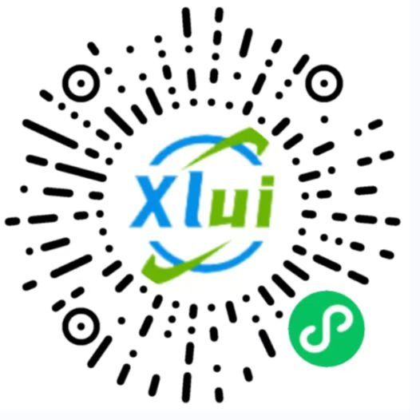
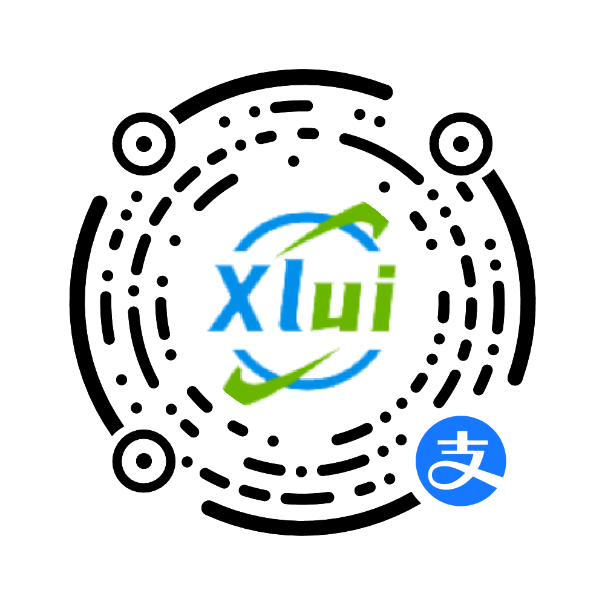

<p align="center">
    
</p>
<h3 align="center" style="margin: 30px 0 30px;font-weight: bold;font-size:40px;">uViewXL</h3>
<h3 align="center">多平台快速开发的UI框架</h3>

<h4>当前版本：1.1.0</h4>

## 说明

uViewXL 重构了uView UI，支持vue3，是[uni-app](https://uniapp.dcloud.io/)生态的UI框架，全面的组件和便捷的工具会让您信手拈来

## [参考文档：https://v1.uviewui.com](https://v1.uviewui.com)

## 特性

- 兼容安卓，iOS，微信小程序，H5，QQ小程序，百度小程序，支付宝小程序，头条小程序
- 60+精选组件，功能丰富，多端兼容，让您快速集成，开箱即用
- 众多贴心的JS利器，让您飞镖在手，召之即来，百步穿杨
- 众多的常用页面和布局，让您专注逻辑，事半功倍
- 详尽的文档支持，现代化的演示效果
- 按需引入，精简打包体积

## 预览

您可以通过扫码，查看最佳的演示效果。
<div style="display:flex;flex-wrap:wrap;">
 <div style="margin-right:10px"></div>
 <div></div>
</div>

## 链接

- [参考文档](https://v1.uviewui.com/)
- [更新日志](https://gitee.com/bwcxwh/uview-xl/CHANGELOG.md)

## 交流反馈

欢迎issues反馈：[点此跳转](https://gitee.com/bwcxwh/uview-xl/issues)

## 安装

## 快速上手

1. `main.js`引入uView库

```javascript
// main.js
import uViewXL from 'uview-xl';
 
app.use(uViewXL)
```

2. `App.vue`引入基础样式(注意style标签需声明scss属性支持)

```css
/* App.vue */
<style lang="scss">
@import "uview-xl/index.scss";
</style>
```

3. `uni.scss`引入全局scss变量文件

```css
/* uni.scss */
@import "uview-xl/theme.scss";
```

如果样式无效，则把`theme.scss`的样式拷贝到`uni.scss`

4. `pages.json`配置easycom规则(按需引入)

```js
// pages.json
{
 "easycom": {
  // 下载安装的方式需要前面的"@/"，npm安装的方式无需"@/"
  // 下载安装方式
  "^u-(.*)": "@/uview-xl/components/u-$1/u-$1.vue"
  // npm安装方式
  // "^u-(.*)": "uview-xl/components/u-$1/u-$1.vue"
 },
 // 此为本身已有的内容
 "pages": [
  // ......
 ]
}
```

请通过[快速上手](https://uviewui.com/components/quickstart.html)了解更详细的内容

## 使用方法

配置easycom规则后，自动按需引入，无需`import`组件，直接引用即可。

```html
<template>
 <u-button>按钮</u-button>
</template>
```

请通过[快速上手](https://uviewui.com/components/quickstart.html)了解更详细的内容

## 捐赠uViewXL的研发

uViewXL文档内容和框架源码全部开源免费，如果您认为uViewXL帮到了您的开发工作，您可以捐赠uViewXL的研发工作，捐赠无门槛，哪怕是一杯可乐也好(相信这比打赏主播更有意义)。


<br />


## 版权信息

uView遵循[MIT](https://en.wikipedia.org/wiki/MIT_License)开源协议，意味着您无需支付任何费用，也无需授权，即可将uView应用到您的产品中。
